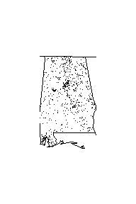
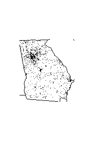
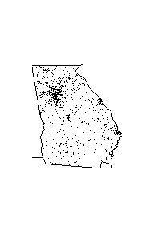
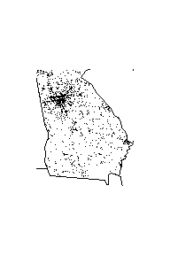

<!-- README.md is generated from README.Rmd. Please edit that file -->

# fars

<!-- badges: start -->

[](https://travis-ci.org/akbarpunjwani/msdr-rpkgexample)
<!-- badges: end -->

The goal of fars is to provide summary counts of accidents that occurred
at different states during the years 2013, 2014 & 2015. Also, it provide
the scatter plots to visualize the same data for each state.

## Installation

You can install the released version of fars from
[CRAN](https://CRAN.R-project.org) with:

``` r
library(devtools)
install_github("akbarpunjwani/msdr-rpkgexample")
library(fars)
```

The FARS, which stands for Fatality Analysis Reporting System, provided
a sample data set for public access to analyze the accidents held in
2013, 2014 & 2015.

This package includes this data for internal use only. However, this
package uses that data and provides a **year wise summarized counts**
(*fars\_summarize\_years*) and the **state wise visualization plots**
(*fars\_map\_state*) for specified year.

## Data Summary

The FARS Accidents data has a time series information of MONTH and YEAR
of the accidents. In order to load & view the counts of accidents for
each of the 12 months for the specified years, below method can be used:

**fars\_summarize\_years(years\_range)** Since the package includes the
dataset of FARS for the years 2013 to 2015, the output would display the
counts having months at row level and years at the column level. In case
any of the year specified in the range is not found than it will show
the result for the years found and mention the warning for those that
were not found.

Examples: *fars::fars\_summarize\_years(2013)*

``` r
fars::fars_summarize_years(2013)
#> Warning: `tbl_df()` is deprecated as of dplyr 1.0.0.
#> Please use `tibble::as_tibble()` instead.
#> This warning is displayed once every 8 hours.
#> Call `lifecycle::last_warnings()` to see where this warning was generated.
#> # A tibble: 12 x 2
#>    MONTH `2013`
#>    <dbl>  <int>
#>  1     1   2230
#>  2     2   1952
#>  3     3   2356
#>  4     4   2300
#>  5     5   2532
#>  6     6   2692
#>  7     7   2660
#>  8     8   2899
#>  9     9   2741
#> 10    10   2768
#> 11    11   2615
#> 12    12   2457
```

*fars::fars\_summarize\_years(2014:2015)*

``` r
fars::fars_summarize_years(2014:2015)
#> # A tibble: 12 x 3
#>    MONTH `2014` `2015`
#>    <dbl>  <int>  <int>
#>  1     1   2168   2368
#>  2     2   1893   1968
#>  3     3   2245   2385
#>  4     4   2308   2430
#>  5     5   2596   2847
#>  6     6   2583   2765
#>  7     7   2696   2998
#>  8     8   2800   3016
#>  9     9   2618   2865
#> 10    10   2831   3019
#> 11    11   2714   2724
#> 12    12   2604   2781
```

*fars::fars\_summarize\_years(2012:2016)* (Warnings expected for 2012 &
2016)

``` r
fars::fars_summarize_years(2012:2016)
#> Warning in value[[3L]](cond): invalid year: 2012
#> Warning in value[[3L]](cond): invalid year: 2016
#> # A tibble: 12 x 4
#>    MONTH `2013` `2014` `2015`
#>    <dbl>  <int>  <int>  <int>
#>  1     1   2230   2168   2368
#>  2     2   1952   1893   1968
#>  3     3   2356   2245   2385
#>  4     4   2300   2308   2430
#>  5     5   2532   2596   2847
#>  6     6   2692   2583   2765
#>  7     7   2660   2696   2998
#>  8     8   2899   2800   3016
#>  9     9   2741   2618   2865
#> 10    10   2768   2831   3019
#> 11    11   2615   2714   2724
#> 12    12   2457   2604   2781
```

## Data Visualization

The FARS Accidents data contains US STATE number where the accident
occured at the given MONTH and YEAR. The package uses this data to
visualize it into a scatter plot for each state, using the below
mentioned method:

**fars\_map\_state(state,year)**

Since the package includes the dataset of FARS accidents having state (1
to 13), month & year (not all years have data for each of the state),
this method helps the user to visualize the data for the specified state
and year. In case any of the state or the year specified is not found
than it will prompt an error accordingly.

Examples:

*fars::fars\_map\_state(1,2013)*

``` r
fars::fars_map_state(1,2013)
```



*fars::fars\_map\_state(13,2013)*

``` r
fars::fars_map_state(13,2013)
```



*fars::fars\_map\_state(13,2014)*

``` r
fars::fars_map_state(13,2014)
```



*fars::fars\_map\_state(13,2015)*

``` r
fars::fars_map_state(13,2015)
```


